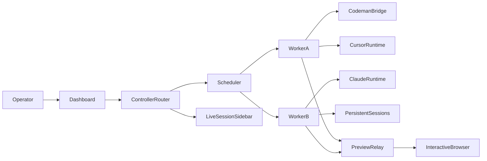

# Architecture

## System boundary

Hosted Agents is a private fleet control plane. It does not replace Codeman
and does not create a shared Cursor/Claude protocol. It coordinates distinct
execution adapters behind one local operator experience.



The sidebar is a live session index, not a second execution system. It groups
active sessions by Worker and workspace:

```text
Worker: mac-mini
  Workspace: payments-api
    Claude · Working
    Codeman · Waiting for input · Preview available
  Workspace: dashboard
    Cursor · Idle
```

Selecting an entry opens the session view. The Controller pushes snapshots and
state changes over the dashboard connection; it does not repeatedly query each
Worker from the browser.

## Machine connection

One chosen local server runs the Controller and web router. Every other machine
runs a Worker client. The Worker initiates an outbound TLS connection to the
Controller and receives only authorized, capability-scoped commands. No inbound
port is required on client machines.

The Controller routes and records work; it never launches shells, agents,
browsers, or containers. A Worker owns local process execution, provider
credentials, Codeman sessions, preview connections, and browser sessions.

## Workspace model

A Worker can expose multiple workspaces. During setup, the operator chooses one
of these policies:

- `folders`: one or more approved root folders. This is the recommended default.
- `system`: whole-system access, explicitly approved and visibly marked as
  unrestricted.

The Worker scans only the permitted scope and reports workspace metadata to the
Controller. A workspace record contains an opaque ID, display name, canonical
path, provider readiness, and health; it does not grant the Controller raw
filesystem access.

The start contract is intentionally ordered:

```text
select machine → select workspace → select agent → start
```

The browser sends a workspace ID, not an arbitrary path. The Worker resolves
the ID to its locally stored canonical path, checks the path remains inside the
current policy, validates the selected provider, and only then launches the
local runtime.

## Setup CLI and persistent worker

The `hosted-agents setup` command is the supported onboarding path. It runs in
four stages:

1. Detect OS, WSL, Node, Git, Codeman, tmux, Docker, browser, and provider CLIs.
2. Show required and optional changes, asking for confirmation before installing
   anything.
3. Generate or import the Worker identity, complete one-time pairing, and store
   credentials in a protected machine-local location.
4. Install our user-level Hosted Agents Worker service and verify the outbound
   connection, capabilities, and local preview relay.

The worker reconnects with backoff after network failures, resumes or reattaches
to durable local sessions where the provider supports it, and shuts down
cleanly on stop/revoke. Provider login remains provider-owned. The setup CLI
only reports whether Codeman, Cursor, and Claude are available and ready; it
must not initiate provider login or copy Cursor/Anthropic secrets into the
Controller.

The connection carries:

- enrollment and identity rotation
- heartbeat and capability snapshots
- job assignment and acknowledgement
- bounded session events
- preview and browser stream frames
- cancellation and shutdown commands

## Preview ports

The node opens a connection to `127.0.0.1` on behalf of a leased preview route.
The control plane authenticates the browser request and relays HTTP, SSE, and
WebSocket traffic over the node connection. A local tunnel helper can expose
the same lease on the operator's loopback interface.

Every route is bound to an owner, node, workspace, session, and expiry time.
Routes are deny-by-default and are never bound to a public listener.

## Interactive browser

The node starts an isolated Chromium/Playwright session and opens an approved
preview URL. The dashboard receives viewport frames and sends back only
authorized browser input events. The raw Chrome DevTools endpoint is never
exposed.

V1 targets webpage viewport streaming. Full desktop/browser-chrome streaming
requires a separate OS capture and remote-desktop subsystem.

## Provider adapters

- `CodemanBridge`: discovers and controls Codeman-managed sessions using its
  supported interface; SSH is a fallback for remote cases.
- `CursorAdapter`: validates and targets the official Cursor machine/pool
  worker path where available.
- `ClaudeAdapter`: validates and targets the official Claude self-hosted
  runner/environment path where available.

Provider failures are surfaced explicitly. The system must not silently
fallback from an official provider to a local CLI session.
